# Penetration Test Report

**Submitted by: Johnson Kofi Atsu Brown**

**Date of Test: September 13, 2024**

**Classification: Confidential**

###### Table of contents

+ Contents
+ Executive Summary
+ Scope of Work
+ Project Objectives
+ Summary of Findings
+ Summary of Reccomendation
+ Methodology
+ Detail Findings
+ Windows Servers 192.168.1.75
+ References

##### Executive Summary

This document details the security assessment of GPEN Inc.
The purpose of this assessment was to provide a review of the security posture of GPEN Inc Internet infrastructure as well as to identify potential weakness in its Internet infrastructure.

##### Scope of Work

 This security assessment covers the remote penetration testing of two accessible service hosted on 192.168.1.75 and 192.168.1.76 addresses.
 The assessment was carried out from a Kali perspective, with the only supplied information being the tested service IP addresses. No other information was assumed at the start of the assessment.

##### Project Objectives

 This security assessment is carried out to gauge the security posture of GPEN Inc's Internet facing hosts. The result of the assessment is then analyzed for vulnerabilities. Giving the limited time that is given to perform the assessment, only immediately exploitable services have been tested. The vulnerabilities are assigned a risk rating based on threat, vulnerability and impact.

##### Summary of Findings

|  Value  | Number of Risks |
| :------: | :-------------: |
|   Low   |        3        |
|  Medium  |        2        |
|   High   |        6        |
| Critical |        6        |

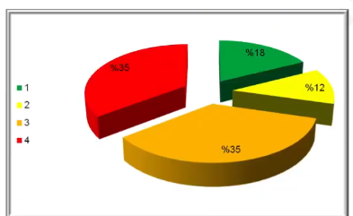
*Total Risks*

GPEN Inc. needs to pay more attention to information security.
 I was able to access one server in less than 1 hour GPEN Inc needs to invest in implementing a defense-in-depth approach to have multiple layers of security to protect their information assets.
 Other areas such as processes and people should be emphasized as well.
 Systems and network hardening and secure configurations, for instance, should be implemented to strengthen the different layers of security within GPEN Inc.Below are the high level findings from the penetration test:

+ GEN Inc lacks a defense in depth (multi-layered) security strategy which if implemented will help GPEN Inc achieves better security level.
+ I found that both servers are not proteced by a firewall and can present a security risks since the host runs a number of services such as Microsoft terminal services without being configured for optimal security. GPEN Inc must design the Firewall policy as follows:

  + Apply Rules to allow only public services such as mail and web access.
  + Allow only authorized IPs to connect to other services or best disabled unneeded services.
  + Apply anti-mapping rules on the border router and primary firewall.
+ It was obvious that GPEN Inc patch management policy and procedure is either not existing or not implemented correctly. One of these servers was running windows 2000 server without any patches. This opened a very high security risks on the organization.
+ Services installed were running with default configuration such as FTP. Web application hosted in 192.168.1.75 is running multiple security vulnerability such as SQL injection and XSS. An attacker can gain access to customer information and manipulate it. GPEN Inc has to implement input validation and redesign the web application component. Best practice is to have 3-tier design. At least the application server and database server should be hosted in different servers and segregated by a firewall.

##### Summary of Recommendation

  Adopt defense-in-depth approach where GPEN Inc utilizes variety of security tools/systems and processes to protect its assets and information. Among these:

+ Deploy Host Intrusion Prevention Systems -HIPS on service and desktop, also enable personal firewall on desktop such as Microsoft Windows Firewall.
+ Perform security hardening on servers in the production environment especially those in the Internet and external DMZs.
+ Implement patch management systems to provide centralized control over fixes, updates and patches to all systems, devices and equipments. This will minimize overhead on operations team and will elevate security resistance.
+ GPEN Inc has to implement input validation and redesign the web application component. Best practice is to have 3-tier design. At least the application server and database server should be hosted in different servers and segregated by a firewall.
+ Conduct vulnerability assessment at least twice a year and penetration testing at least once a year or if there is a major change in the information assets.
+ Develop and implement a training path for the current IT staff.

##### Methodology

+ Planning
+ Exploitation
+ ##### Planning

During planning, we gather information from public sources to learn about targets.
Then, we detect the live system its operating system and determined the running services and its versions.

+ ##### Exploitation

Utilizing the information gathered in planning, I initiated to find the vulnerability for each operating system and services with special tools.

##### Detail findings

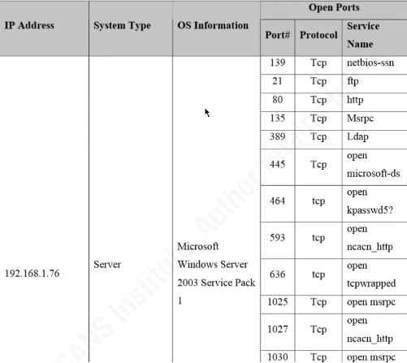

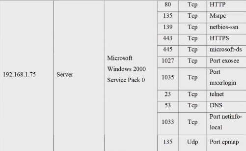

*Targets open ports*

##### Windows Server 192.168.1.75

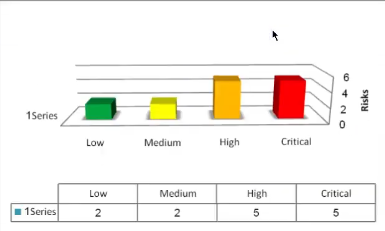

###### Unsecure service (Telnet) is running

**Threat Level**

Medium

**Vulnerabilty**

Medium

### Analysis

 Telnet provides access to the server for remote administration as an example.

Unfortunately telnet traffic is not encrypted. Suspicious users i.e. attackers with easy accessible sniffer can sniff the traffic, which may include sensitive data and administrator credentials.

 By 10 telneting to 192.168.1.75, we were able to see telnet service version 5.00.

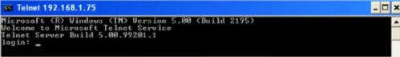

**Impact**

High

**Risks Rating**

Low

**Recommendation**

 If deemed necessary for this server to be administered remotely, utilize secure administration tools such as SSH or secure remote desktop access.

#### Microsoft RPC Interface Buffer Overun:

**Threat Level**

High

**Vulnerability**

Critical

#### **Analysis**

 The remote host is running a version of Windows, which has a flaw in its RPC interface, which may allow an attacker to execute arbitrary code and gain system privileges. An attacker or a worm could use it to gain the control of this host.

I exploit this vulnerability utilizing a ready exploit available in the Internet.

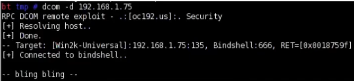

 After exploiting this vulnerability I got a shell and as you can see the IP address is the server IP address.

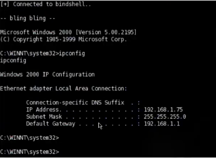

*Getting shell access*

 I also utilize this vulnerability to upload and download file through meterpreter as described below:

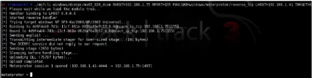

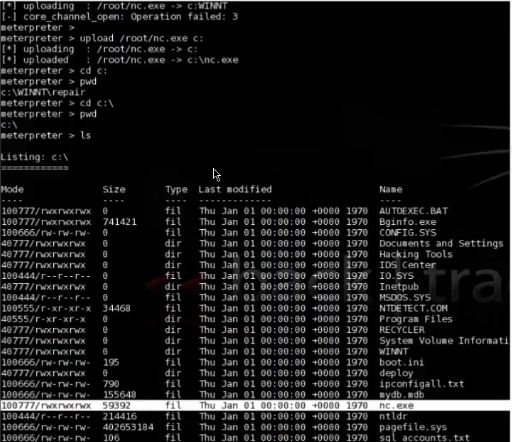

*Uploading nc.exe as backdoor*

 I opened a command shell using meterpreter and run nc.exe to listen on port 2222/TCP:

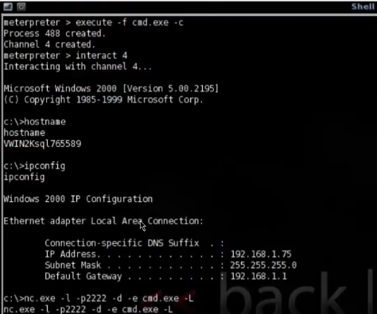

*Shell command and running nc*

 And downloading SAM file for cracking the system passwords offline: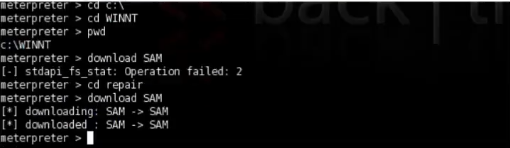

*Downloading SAM file*

**Impact**

Critical

**Risk Rating**

Critical

#### Recommendation

Patch the system with the latest patches from Microsoft.

[https://www.microsoft.com/technet/security/bulletin/MS03-039.mspx]()

### References

[https://www.cve.org/CVERecord?id=CVE-2003-0813]()

[CVE Record | CVE](https://www.cve.org/CVERecord?id=CVE-2024-6422)

[CVE Record | CVE](https://www.cve.org/CVERecord?id=CVE-2007-1748)
